# Week 1 Lab Report

## Installing VS Code

* Go to https://code.visualstudio.com/ to download VS Code
* Click Download and this screen should appear. 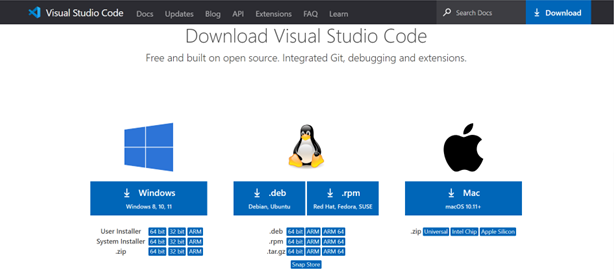 Select the option that fits your computer and follow the instructions. I chose the Windows System Installer which from my understanding should allow all users on my laptop to use it.

* It should open to this page after it installs:

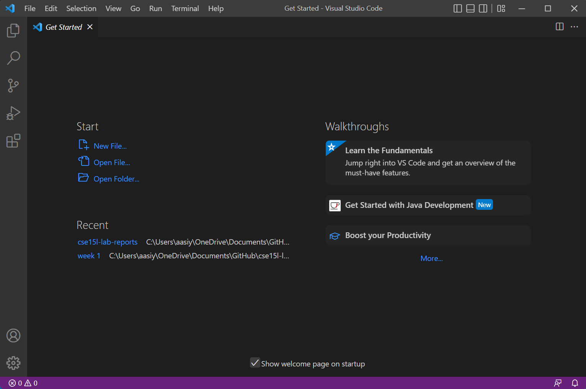

## Connecting Remotely

* First, look up your account at https://sdacs.ucsd.edu/~icc/index.php.
You will find it under "Additional Accounts", and it will look something like cse15lfa22zz, except with the "zz" replaced with unique letters that represent your account. Reset the password for this account. It will take a few hours to reset.

* Next, click on Terminal in VS Code and select New Terminal. Then type in:

ssh \<YourUserName\>@ieng6.ucsd.edu

I had to use ashaikh@ieng6.ucsd.edu (My Active Directory name)  because the autogenerated username was not working. 

This will connect you to the remote computer.

* Enter your password when prompted

* It should give something like this:

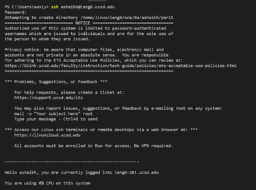

## Trying Some Commands
* Once connected you can try out some commands on the remote shell. 
* For example, ls will list the files in the directory, cd will navigate to a new place and ~ will take you to the home directory. 
* You can also use "exit" to leave the remote shell and return to your pc.

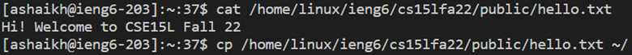

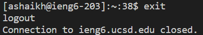

## Moving Files with scp

* You can use the command scp to save files from your computer onto a remote shell. 
* First save the file on your computer and then navigate to where it's saved in your terminal
* The use scp like this:

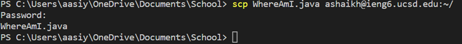

The file is now copied onto the remote shell. If you use SSH to log into the remote shell again and then use ls, you should see it:

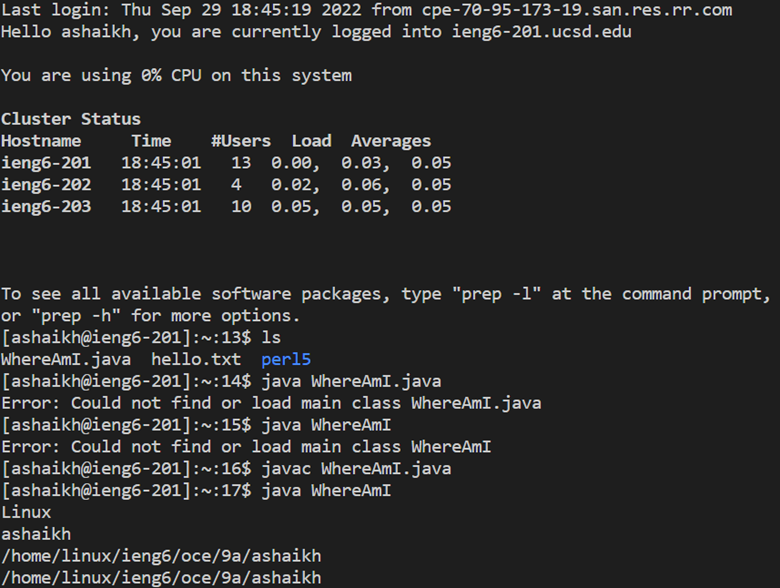

## Setting an SSH Key
* Type ssh-keygen into the Terminal to generate a key pair. It will ask you to select a place to save, but you can just press enter to use the default. You can also leave the paraphrase empty. It should now show you where the keys are saved and the key's randomart image.
* For windows, you have to also do the following: 
* 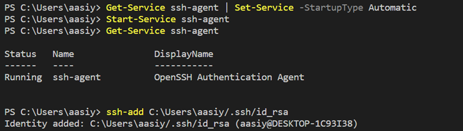
*If you get an error, close VS Code. Right click on the icon and select "Run as Administrator". It should reopen and you can try again.
* log back into the remote shell using ssh
* type mkdir .ssh into the terminal on the server. I found that it already existed so I just used that one.

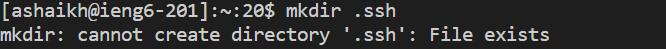
* Then exit the remote shell
* Back on your computer, type: 

scp /Users/\<your User\>/.ssh/id_rsa.pub \<your User\>@ieng6.ucsd.edu:~/.ssh/authorized_keys

Like this:

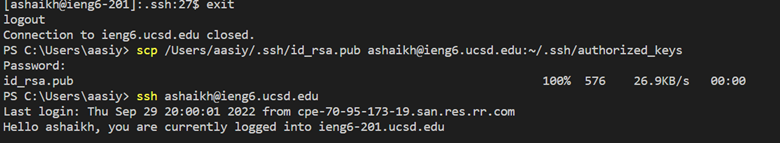

Enter your password when prompted. This should  copy the public key to the remote computer. Now when you use ssh, no need to enter your password.

## Optimizing Remote Running
* Now that you no longer need to enter a password, it takes less keystrokes to do things

* You can execute multiple commands at once by using a semicolon between commands

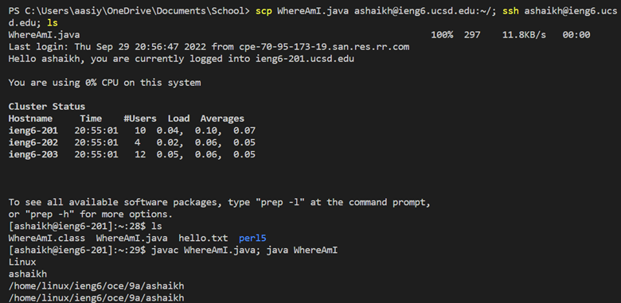

* If you put commands run on remote shell in quotation marks, it runs those commands then exits the remote shell. For example:

 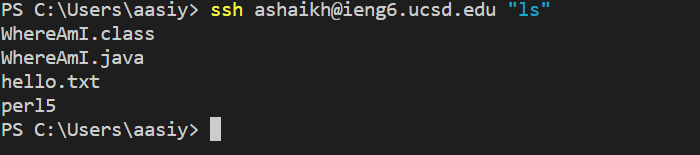

* This can help optimize remote running by performing multiple operations at once. So, to make a local edit to a file, copy it to the remote server, compile and run, this is what I did, which was much quicker:

First I made a small edit to the file by adding the output "Finished running program" atthe end:

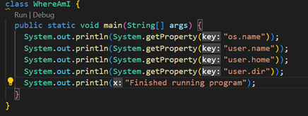

Then I navigated to the directory which the file was saved in and ran commands on one line which did everything at once, including exiting and returning to the local terminal:

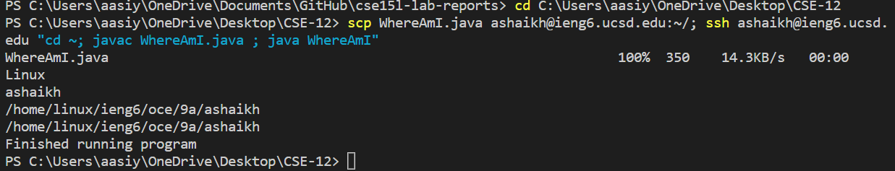

