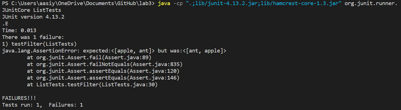

# Week 3 Lab Report

## Part 1 - Search Engine

Code:

```
import java.io.IOException;
import java.net.URI;
import java.util.ArrayList;

class Handler implements URLHandler  {
    ArrayList<String> strs = new ArrayList<String>();

    public String handleRequest(URI url) {

        if (url.getPath().contains("/add")) {
            String[] parameters = url.getQuery().split("=");
            if (parameters[0].equals("s")) {
                strs.add(parameters[1]);
                return ("current list: " + strs);
            }

        }

        if (url.getPath().contains("/search")) {

            String[] parameters = url.getQuery().split("=");
            ArrayList<String> foundStrs = new ArrayList<>();
            String currStr;

            if (parameters[0].equals("s")) {
                for (int i = 0; i < strs.size(); i++) {
                    currStr = strs.get(i);
                    if (currStr.contains(parameters[1])) {
                        foundStrs.add(currStr);
                    }
                }
                return ("found strings: " + foundStrs);
            }
        }

        return "404 Not Found";
    }

}
class SearchEngine {
        public static void main(String[] args) throws IOException {
            if(args.length == 0){
                System.out.println("Missing port number! Try any number between 1024 to 49151");
                return;
            }
    
            int port = Integer.parseInt(args[0]);
    
            Server.start(port, new Handler());
        }
    }
```
### Running the server and using add:


* First, the main method in the SearchEngine class is called, and it starts the server using the argument provided as the port number. It also creates a Handler object.
* In the Handler class, an empty arrayList of Strings called strs is created which will be used to store the words.
* The user enters the server's url into a browser which includes add? and s=pineapple, which tells the program to add that string to the list of words. It does this by calling the handleRequest method from the Handler class, which takes the url (a URI) entered as an argument.
* The handleRequest method checks if the url provided contains "add" or "search" in the query part of it. In this case it contained "add". It then creates an array called parameters, in which the string to be added ("pineapple") is stored at the index 1. So the value at parameters[1] is added to strs.
* At the end of processing strs changes to include the string given in the url.
* It returns the Arraylist strs so that the user can see the current list of words and confirm that the word was added to it. 

### Using add again:


* Again, when the user enters the url into the browser, handleRequest is called from the Handler class, and it takes the url as an argument.
* It checks if the query contains "add" or "search". Since it contained "add", it adds the string "banana" to strs. 
* Before calling the method, strs was [apple, hello, pineapple, apps]. After processing, strs is changed to contain the string given in the url, and becomes [apple, hello, pineapple, apps, banana].

### Searching for words containing a substring:


* handleRequest is called from the Handler class, and it takes the url entered by the user as an argument.
* It checks if the query of the url contains "add" or "search". Since it contains search, it puts the string "app" into parameters[1]. It also creates a new arrayList called foundStrs to store the strings which contain the substring to search for.
* It then iterates through strs, which is currently [apple, hello, pineapple, apps, app, banana]. If strs[i] contains parameters[1], it adds strs[i] to foundStrs.
* Once it is done processing, it returns foundStrs. strs does not change.


## Part 2

For ArrayExamples, this is the test which failed: 

```
@Test 
	public void testReverseInPlaceMany() {
    int[] input1 = {1, 2, 3};
    ArrayExamples.reverseInPlace(input1);
    assertArrayEquals(new int[]{3, 2, 1},   input1);
	}
```


* The failure-inducing input for ReverseInPlace was the array returned when the array {1, 2, 3} was passed to reverseInPlace
* The symptom was that instead of returning {3, 2, 1}, it returned {3, 2, 3}
* I fixed it by adding a temporary array and assigning it to arr once things were reversed.

* The bug was that the contents of the original array were being changed before everything could be reversed. So values were “disappearing” and then the wrong value was being copied.

For ListExamples, this is the test which failed:

```
@Test
    public void testFilter() {
        List<String> list1 = new ArrayList<>();
        startsWithA aStart = new startsWithA();
        list1.add("apple");
        list1.add("ball");
        list1.add("cat");
        list1.add("ant");
        List<String> list2 = new ArrayList<>();
        list2.add("apple");
        list2.add("ant");

        assertEquals(list2, ListExamples.filter(list1, aStart));
       
    }
```
* The failure-inducing input was the filtered list returned when filter was called with the arguments of this list: [apple, ball, cat, ant] and a startsWithA object. 
* The symptom was that it should have returned [apple, ant], but instead returned it in a reversed order as [ant, apple].



*The fix is to remove the index 0 from add in the filter method of the ListExamples class. This will make it so that it adds the filtered strings in the correct order, at the end of the list.


```
        result.add(0,s);

```
should be changed to
```
        result.add(s);
```

* The bug is that it iterated through the provided list, and as it found matching words, it added them to the beginning of the new list instead of the end. The 0 made it so that the strings were prepended to the list. So it reversed the order.

