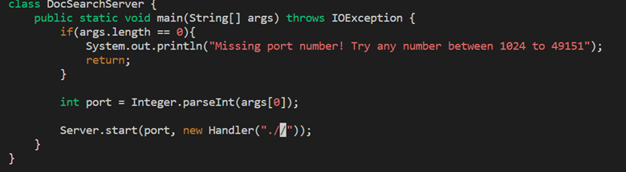

# Lab Report 4

## Part 1

The change I made was :
* In DocSearchServer.java, change the main method so that rather than hardcoding the search on the ./technical directory, it uses the second command-line argument for the path to search.


Keys typed to make the change: 

```
\tec<enter>ndwlli<backspace><backspace><backspace><backspace><backspace>args[1]<esc>:wq<enter>

```

(27 keys total)

1. Opening vim on DocSearchServer.java and the cursor is at the beginning of the file:


2. Type /tec and `<enter>`. This makes vim look for the string "tec" and takes the cursor to the first instance of it:


3. Press n to jump to the next instance of "tec":


4. Type dw to delete the word



5. Type "lli" to go left twice and then enter insert mode:


6. Backspace five times to delete everything in the brackets:


7. type in "args[1]"


8. Press `<esc>` to exit insert mode, and then type ":wq " and `<enter>` to save and exit vim.


## Part 2

For the first style, where I edited in VS Code and then used scp to copy the files to the remote, it took me 473 seconds. I ran into a problem trying to use start.sh because in that bash file, there is only one argument given, so I had to change it to contain $1 and $2.

For the second style, it took me 359 seconds. I didn't really run into any issues and knew what to do already.

For making small edits on remote files like this, I would definitely prefer using vim on the remote. It's much easier to open the file there and save it directly there, as compared to having to repeatedly copy over new files. Maybe if it were a more complicated program and test files to write, it would be easier to type it on VS Code because Vim commands can get confusing.