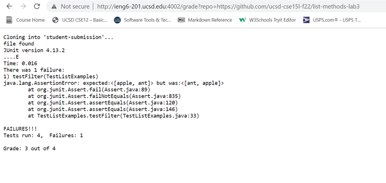

# Lab Report 5
## grade.sh 
```
rm -r student-submission
git clone $1 student-submission
cd student-submission

GRADE=0

if [[ -f ListExamples.java ]]; then
  echo "file found"
else
  echo "ListExamples.java file not found"
  echo "Grade: "$GRADE
  exit
fi

cd ~
cp TestListExamples.java student-submission
cp -r lib student-submission
cd student-submission

javac -cp .:../lib/hamcrest-core-1.3.jar:../lib/junit-4.13.2.jar *.java

if [[ $? -ne 0 ]]; then
  echo "Compilation failed"
  echo "Grade: "$GRADE
  exit
fi

java -cp .:../lib/hamcrest-core-1.3.jar:../lib/junit-4.13.2.jar org.junit.runner.JUnitCore TestListExamples > passed.txt       

cat passed.txt

RESULT=`grep -c "OK (4 tests)" passed.txt`
if [[ $RESULT -eq 1 ]]; then
        GRADE=4
        echo "Grade: "$GRADE" out of 4"
        exit
fi

RESULT=`grep -c "Tests run: 4,  Failures: 1" passed.txt`
if [[ $RESULT -eq 1 ]]; then
        GRADE=3
        echo "Grade: "$GRADE" out of 4"
        exit
fi

RESULT=`grep -c "Tests run: 4,  Failures: 2" passed.txt`
if [[ $RESULT -eq 1 ]]; then
        GRADE=2
        echo "Grade: "$GRADE" out of 4"
        exit
fi

RESULT=`grep -c "Tests run: 4,  Failures: 3" passed.txt`
if [[ $RESULT -eq 1 ]]; then
        GRADE=1
        echo "Grade: "$GRADE" out of 4"
        exit
fi

RESULT=`grep -c "Tests run: 4,  Failures: 4" passed.txt`
if [[ $RESULT -eq 1 ]]; then
        GRADE=0
        echo "Grade: "$GRADE" out of 4"
        exit
fi
```
### Example 1

### Example 2

### Example 3


## Trace of grade.sh on https://github.com/ucsd-cse15l-f22/list-methods-lab3 by line number

line 3: "rm -rf" deletes the student-submission folder, so that a new submission can be graded instead of the old one. Doesn't produce any output. Exit code is 0

line 4: "git clone" copies the repository to be graded (https://github.com/ucsd-cse15l-f22/list-methods-lab3) into a folder called student-submission, located in the home directory. No output, exit code is 0.

line 5: "cd student-submission" navigates into the 
student-submission folder. No output, exit code is 0.
line 7: Assigns the value 0 to the variable GRADE. No output. Exit code is 0.

line 9: This if statement looks for the file in the current folder using -f. Since it is present, the if condition evaluates to true. Exit code is 0.

line 10: "file found" is output as standard output using the command "echo".

line 11 to 15. Are not executed as these are the "else" branch

line 17: "cd ~" navigates to the home directory. Exit code is 0.

line 18: copies a file called TestListExamples.java into student-submission. Exit code is 0.

line 19: recursively copies the contents of a folder called lib into student-submission. Exit code is 0.

line 20: "cd student-submission" navigates into the student-submission folder. No output, exit code is 0.

line 22: Compiles all the java files using "javac". "-cp" and the path after that sets the class path for the jUnit files which will be used to test the submission. Exit code is 0 because the compilation is successful.

line 24: This if statement evaluates to false because the exit code was 0.

line 25 to 28 don't run because the if statement was false.

line 30: The command "java" is used with the classpath for JUnit again, on the file TestListExamples.java. This runs TestListExamples, which contains the JUnit tests for the student's submission. Exit code is 0 because the file executed successfully.
"> passed.txt" redirects the standard output to a file called passed.txt. 
* Even though one JUnit test failed on this submission, there was no output to stderr because the test itself ran successfully.

line 32: This line outputs the contents of the file passed.txt. Exit code is 0 and the standard output would be the file contents.

line 34: This line assigns the result of the grep -c command (0) to the variable RESULT. The exit code is 0 and there is no output.

line 35: Since RESULT is 0, this if statement evaluates to false. 

line 36 to 39 don't run.

line 41: This line again assigns the result of the grep -c command (1) to the variable RESULT. The exit code is 0 and there is no output.

line 42: Since the if statement evaluates to true, the following lines are executed. The exit code is 0.

line 43: The number 3 is assigned to GRADE. Exit code is 0, no output.

line 44: "Grade: 3 out of 4" is output using "echo". The exit code is 0 and the standard output is "Grade: 3 out of 4".

line 45: The bash script is now exited (early). Exit code is 0, no output.

